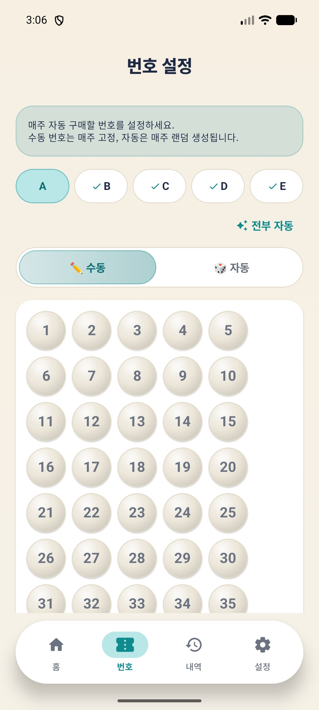
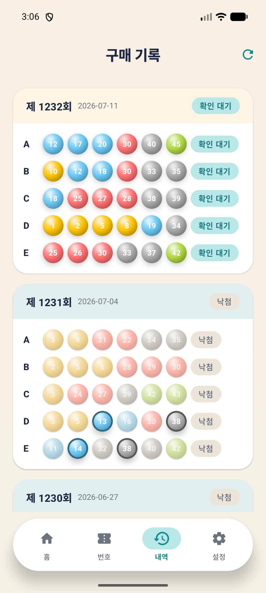

# 🎰 AutoLotto

동행복권 로또 6/45 자동 구매 & 당첨 확인 앱

[](LICENSE)
[](https://flutter.dev)
[](https://developer.android.com)


<p align="center">
  <a href="https://autolotto.umicorp.kr">
    
  </a>
</p>

## ✨ 주요 기능

- **자동 구매** — 설정한 요일/시간에 자동으로 로또 구매 (최대 5게임)
- **수동/자동 번호** — 게임별로 수동 번호 지정 또는 자동 생성 선택
- **당첨 확인** — 매주 토요일 21:00 자동 당첨 확인 & 푸시 알림
- **구매 기록** — 게임별 번호, 등수, 당첨금 한눈에 확인
- **보안 저장** — 계정 정보는 Android Keystore 암호화 저장

## 📱 스크린샷

<p align="center">
  
  
  
  
</p>

## 🔧 빌드 방법

### 요구 사항

- Flutter 3.41 이상
- Android SDK 36
- Java 17

### 빌드 & 설치

```bash
# 의존성 설치
flutter pub get

# Hive 어댑터 재생성 (필요 시)
dart run build_runner build --delete-conflicting-outputs

# 릴리즈 APK 빌드 (ABI별 분리)
flutter build apk --release --split-per-abi
```

빌드된 APK: `build/app/outputs/flutter-apk/app-arm64-v8a-release.apk`

## 📂 프로젝트 구조

```
lib/
├── main.dart                      # 앱 진입점, 자동 로그인
├── app.dart                       # 하단 탭 네비게이션
├── models/                        # 데이터 모델 (Hive)
│   ├── purchase.dart
│   └── result.dart
├── data/
│   ├── database.dart              # Hive 초기화
│   └── repositories/              # 로컬 DB CRUD
├── services/
│   ├── auth_service.dart          # 동행복권 로그인 (RSA 암호화)
│   ├── purchase_service.dart      # 로또 구매 API
│   ├── result_service.dart        # 당첨번호 조회
│   ├── history_service.dart       # 구매 내역 조회
│   ├── scheduler_service.dart     # AlarmManager 스케줄링
│   ├── balance_alert_service.dart # 잔액 부족 알림
│   └── secure_storage.dart        # 암호화 저장소
├── screens/
│   ├── splash_screen.dart         # 스플래시 (자동 로그인)
│   ├── home_screen.dart           # 홈 (카운트다운, 당첨번호)
│   ├── number_screen.dart         # 번호 설정 (수동/자동)
│   ├── history_screen.dart        # 구매/당첨 기록
│   └── settings_screen.dart       # 설정 (계정, 자동구매)
├── providers/
│   └── providers.dart             # Riverpod 상태 관리
├── l10n/                          # 다국어 지원 (ko, en, ja)
└── utils/
    ├── constants.dart             # API URL 상수
    ├── crypto.dart                # RSA 암호화
    └── ui_helpers.dart            # 공통 UI 유틸
```

## 🔐 보안

- 계정 정보는 `flutter_secure_storage`로 **Android Keystore** 암호화 저장
- 로그인 비밀번호는 동행복권 서버의 **RSA 공개키로 암호화** 후 전송
- 디버그 로그는 릴리즈 빌드에서 비활성화
- 모든 API 통신은 HTTPS

## ⚠️ 주의사항

- 이 앱은 **동행복권(dhlottery.co.kr) 계정**이 필요합니다
- 로또 구매에는 **예치금 충전**이 선행되어야 합니다
- 구매 가능 시간: 평일/일요일 06:00~23:59, 토요일 06:00~19:59
- 자동 구매가 정상 동작하려면 **배터리 최적화 제외** 설정을 권장합니다
- Google Play 도박 정책으로 인해 **스토어 배포 불가** → GitHub APK 직접 배포

## 🗺️ 로드맵

- [x] Phase 1: 로그인, 자동 구매, 당첨 확인, 구매 기록
- [ ] Phase 2: 예치금 자동 충전

## ⚖️ 면책 조항

동행복권의 공식 앱이 아니며, 사용에 따른 모든 책임은 사용자에게 있습니다. 동행복권 이용약관을 확인하고 본인의 판단 하에 사용하시기 바랍니다.

## 📄 라이선스

[MIT License](LICENSE) — 자유롭게 사용, 수정, 배포 가능합니다.

